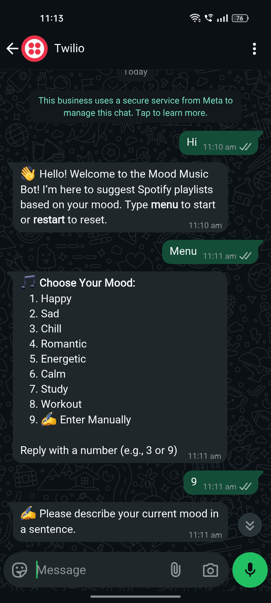

# 🎵 WhatsApp Mood-Based Music Recommender Bot

An AI-powered WhatsApp chatbot that recommends personalized Spotify playlists based on your mood. Built using **Flask**, **Twilio**, and the **Spotify Web API**, with optional mood detection using **NLP (TextBlob)**.



---

## 📌 Features

- 🔥 Real-time WhatsApp chatbot using Twilio
- 🧠 Detects user mood via:
  - Predefined mood menu options (Happy, Sad, Romantic, etc.)
  - Manual text input analyzed with NLP (TextBlob)
- 🎵 Spotify playlist suggestions for Hindi, English, Lofi, Bollywood, Instrumental, and Devotional music
- 🔁 Commands like `menu` and `restart` to navigate chatbot flow
- 🌐 Free deployment via Render

---

## 📸 Screenshots

> Add screenshots of your WhatsApp conversation using this bot.

- `screenshots/whatsapp-bot-preview.jpg`
- `screenshots/chatbot-flow.png`
- `screenshots/chatbot-flow_2.png`
- `screenshots/chatbot-flow_3.png`

---

## 💡 How It Works

1. User sends a message (e.g., `menu`) on WhatsApp.
2. Bot asks for mood selection — either from menu or manual description.
3. If manual, NLP is used to detect mood from message.
4. User selects preferred music type.
5. Bot responds with a Spotify playlist link based on detected mood and music type.

---

## 🛠️ Technologies Used

| Category       | Tech Used            |
|----------------|----------------------|
| Language       | Python               |
| Web Framework  | Flask                |
| Messaging API  | Twilio (WhatsApp)    |
| NLP Engine     | TextBlob             |
| Music API      | Spotify Web API      |
| Deployment     | Render (Free Hosting)|

---

## 📂 Project Structure

```
mood-music-bot/
├── app.py                # Main Flask app and Twilio webhook
├── spotify_helper.py     # Spotify playlist fetch logic
├── nlp_helper.py         # Mood detection using TextBlob
├── requirements.txt
├── README.md
└── screenshots/          # WhatsApp preview images
```

---

## 🚀 Getting Started

### 1. Clone the repository

```bash
git clone https://github.com/your-username/mood-music-bot.git
cd mood-music-bot
```

### 2. Install dependencies

```bash
pip install -r requirements.txt
```

### 3. Configure credentials

- Set your Spotify API credentials in `spotify_helper.py`.
- Connect Twilio WhatsApp sandbox and set your webhook URL to `/webhook`.

### 4. Run locally

```bash
python app.py
```

---

## 🌐 Deploy on Render

1. Push the project to GitHub
2. Create a free web service on [https://render.com](https://render.com)
3. Set build and start command:
   ```bash
   pip install -r requirements.txt
   python app.py
   ```
4. Add the `/webhook` URL to your Twilio WhatsApp sandbox settings

---

## 💬 User Commands

- `menu` → Show mood options
- `restart` → Reset the session
- `9` → Enter mood manually using natural language
- `"I feel low"` → NLP detects *sad* mood
- `2` → English songs → Spotify link sent

---

## 🌱 Future Improvements

- 🎯 Improve mood detection using AI models (e.g., HuggingFace)
- 🧠 Integrate GPT-based emotion chat
- 📱 Build frontend dashboard for mood analytics
- ✅ Add WhatsApp interactive buttons using Twilio Business API

---

## 📜 License

MIT License. Free to use and modify with credit.

---

## 🙌 Author

Developed with ❤️ by **Kevin Savaliya**  
[GitHub](https://github.com/kevin-savaliya)